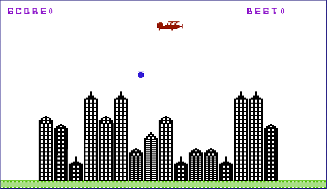

# Blitz 🛩️
A reproduction of the Vic20 game "Blitz" made for the web.

## The game
The goal of the game is to bomb all the buildings underneath, but with a limited time, since you plane has to go lower each time you pass. A new bomb can be launched only when the old one has exploded. To win you have to make it to the ground safely.

## Controls

- ```Desktop``` - Space to launch a bomb
- ```Mobile``` - Tap to lauch a bomb


### Screenshots

